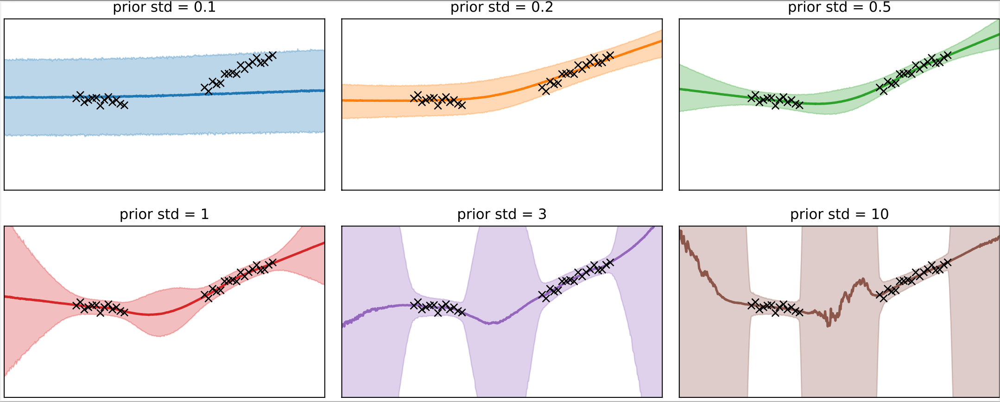
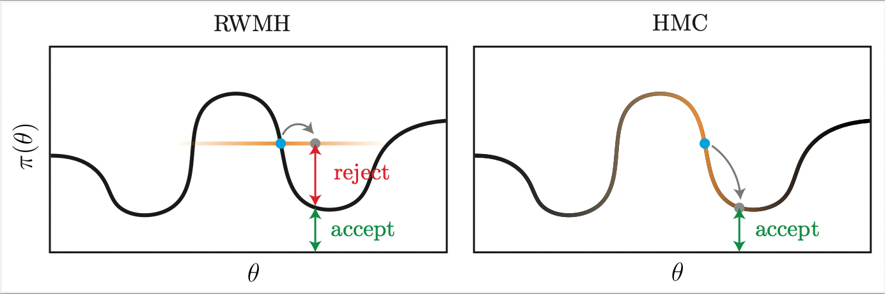
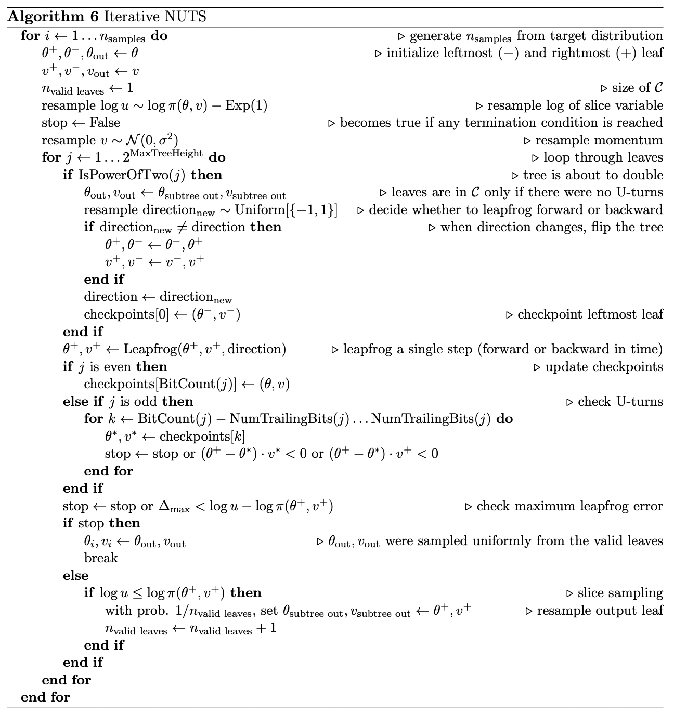

# Learning Distributions with Neural Networks

The focus of my bachelor's thesis was understanding Bayesian neural networks (BNNs), which offer superior performance to standard neural networks at a great computational cost.

Rather than using fixed weights, BNNs learn a posterior distribution over weights. We can draw samples from this distribution:

A crucial parameter of a BNN is the prior. For example, we can vary the standard deviation of the prior to obtain different levels of regularization:

The posterior distribution is highly multi-modal and thus difficult to sample. Here's a 2D slice through the posterior of a tiny MLP:

The posterior is typically sampled using Hamiltonian Monte Carlo (HMC) or the No-U-Turn Sampler (NUTS). In my experiments, NUTS never detected a single U-turn, and thus performed poorly. This would be interesting to explore further.

This repo includes a vectorized SPMD JAX implementation of HMC and NUTS from scratch.

