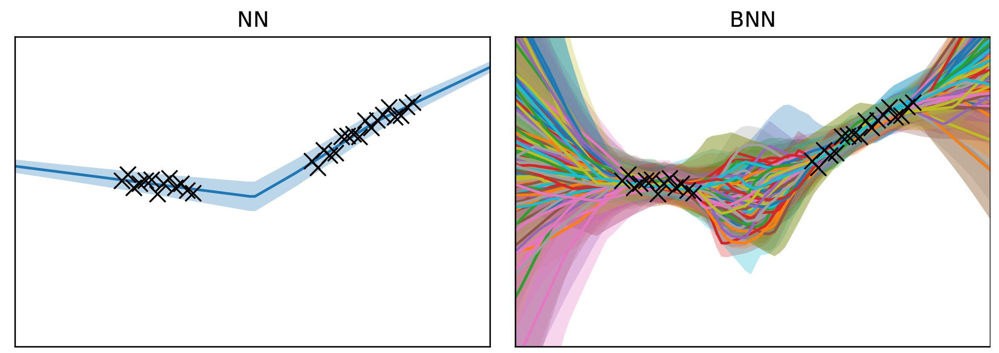
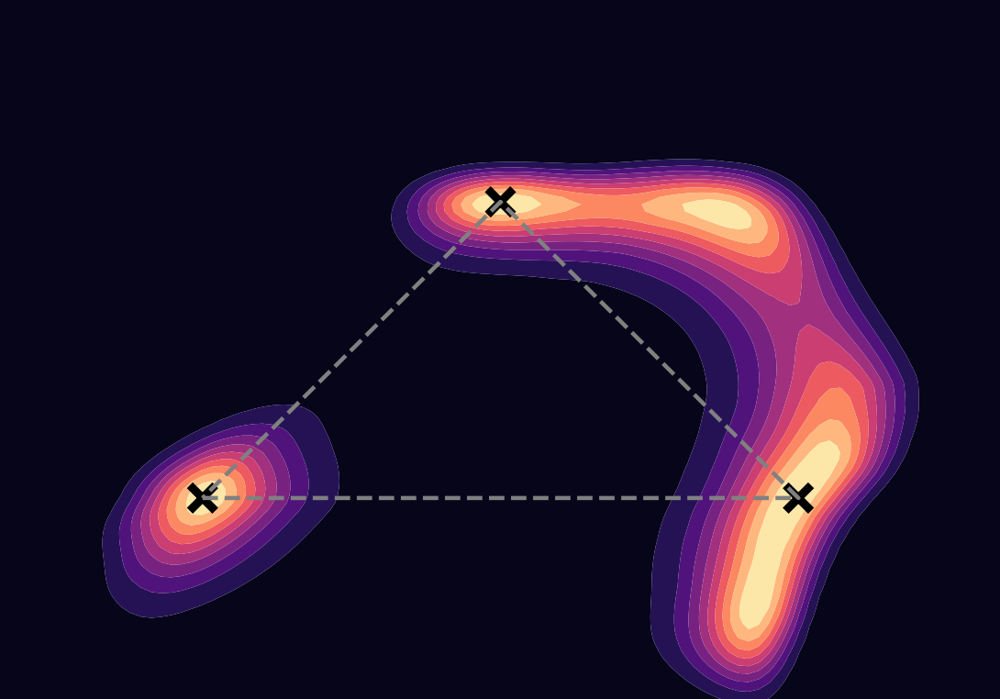

# Learning Distributions with Neural Networks

The focus of my bachelor's thesis was understanding Bayesian neural networks (BNNs), which offer superior performance to standard neural networks at a great computational cost.

Rather than using fixed weights, BNNs learn a posterior distribution over weights. We can draw samples from this distribution:

The posterior distribution is highly multi-modal and thus difficult to sample. Here's a 2D slice through the posterior of a tiny MLP:

The posterior is typically sampled using Hamiltonian Monte Carlo (HMC) or the No-U-Turn Sampler (NUTS). I implemented both algorithms from scratch using SPMD parallelism in JAX.

My final report is available [here](essay.pdf).
